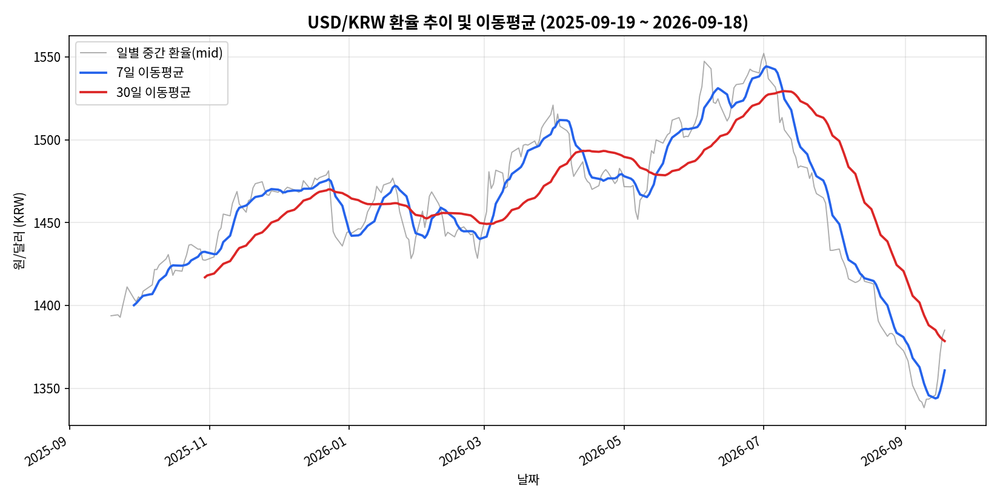
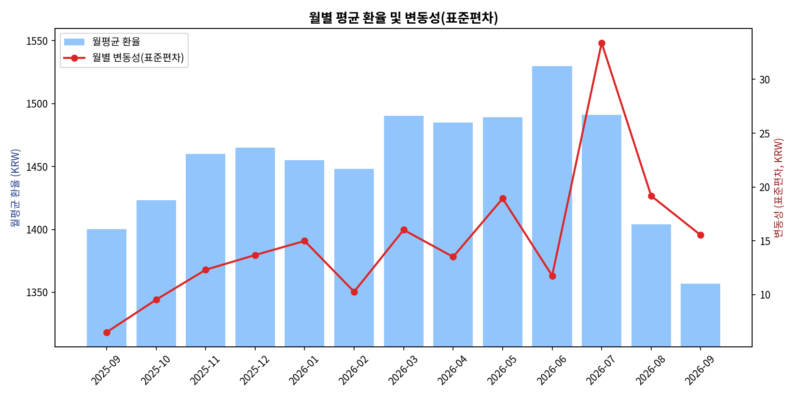
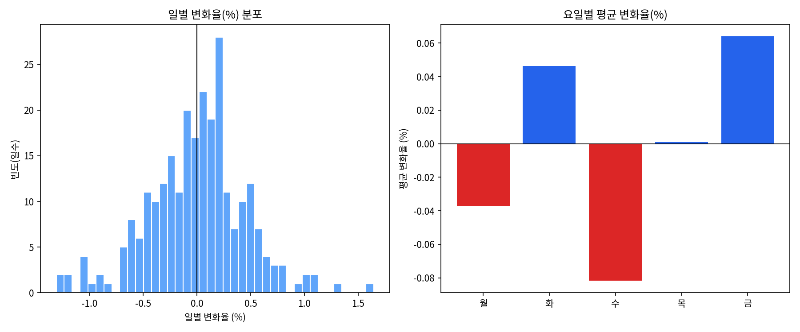
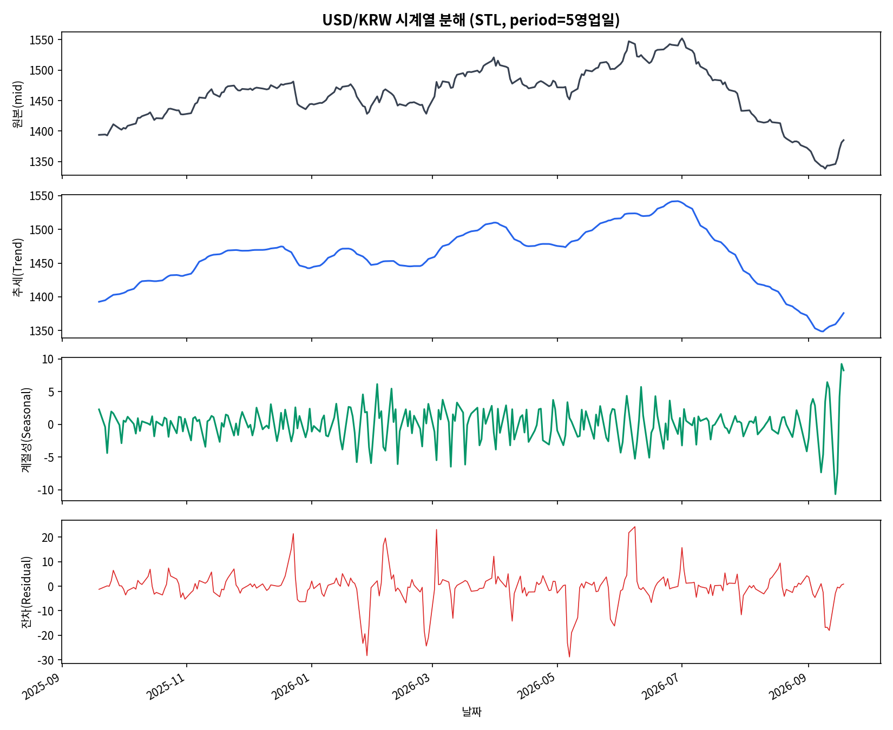
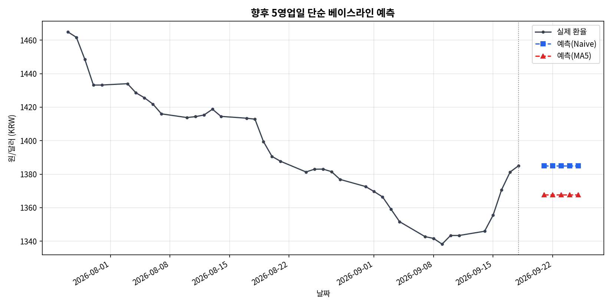

# USD/KRW(달러-원) 환율 1년 트렌드 분석 리포트

## 1. 분석 주제 및 선정 이유

2025년 9월~2026년 9월은 중동 지정학적 리스크, 국제유가 급등, 미국 연준(Fed)의 통화정책 기조 변화 등 대외 변수가 원/달러 환율에 강하게 작용한 시기였다. 실제로 이 기간 환율은 **1338원 ~ 1552원**까지 200원 넘게 출렁였다. 이렇게 변동성이 큰 구간을 데이터로 직접 확인하고, 급등락 시점을 실제 뉴스와 교차 검증해보고자 이 주제를 선정했다.

## 2. 분석 질문 (4개)

1. 지난 1년간 USD/KRW는 전반적으로 상승/하락 추세를 보였는가? *(그래프로 확인 가능)*
2. 급등·급락 구간은 언제였으며, 어떤 외부 요인과 연관지어 볼 수 있는가? *(해석 필요)*
3. 월별 변동성(표준편차)이 다른가? 변동성이 유독 컸던 시기가 있었는가? *(그래프로 확인 가능 + 해석)*
4. 일별 변화율에 요일별 패턴이 있는가? *(그래프로 확인 가능, 해석 시 주의 필요)*

## 3. 데이터 설명

- **출처**: [Pound Sterling Live – U.S. Dollar-South Korean Won History](https://www.poundsterlinglive.com/history/USD-KRW) (영국 Bank of England 기준환율 데이터베이스 기반, 일별 시가/종가/고가/저가/중간값 제공)
- **기간**: 2025-09-19 ~ 2026-09-18 (영업일 기준, 최근 1년)
- **데이터 수**: 261행 (영업일 기준, 요구 조건인 100개 이상 충족)
- **컬럼**: `date`(날짜), `open`(시가), `close`(종가), `high`(고가), `low`(저가), `mid`(중간값 — 본 분석의 주요 지표)
- **라이선스/이용 주의**: 해당 사이트는 데이터의 상업적 재배포 시 별도 허가가 필요할 수 있다고 명시하고 있어(사이트 하단 저작권 고지), 본 프로젝트는 **학습·개인 연구 목적**으로만 사용한다.

## 4. 데이터 정제 (결측치/이상치)

| 항목 | 결과 |
|---|---|
| 결측치(NaN) | 0건 |
| 영업일 기준 캘린더 대비 빠진 날짜 | 0건 |
| 이상치 후보 (mid, z-score \|z\|>3) | 0건 |

원본 데이터가 이미 정제된 금융 데이터였기 때문에 실제 결측치·이상치는 발견되지 않았다. **다만 재현성을 위해 처리 기준을 다음과 같이 명시한다:**
- 결측치가 있었다면: 거래가 없는 날(공휴일 등)로 간주하고 **선형 보간(interpolation)** 하지 않고 제외한다(주가·환율은 휴장일에 값이 생성되지 않는 것이 정상이므로 임의 보간은 오히려 왜곡을 유발할 수 있음).
- 이상치가 있었다면: `mid` 기준 z-score 절댓값이 3을 초과하는 날을 후보로 플래그하되, 실제 뉴스 검색으로 급등락의 실체가 확인되면(예: 지정학적 이벤트) 이상치로 **제거하지 않고** 유지한다. 데이터 입력 오류로 판단되는 경우(예: 자릿수 오류로 10배 차이)만 제거한다.

## 5. 적용한 시계열 분석 기법 (총 4가지)

1. **이동평균(Moving Average)**: 7일(단기), 30일(중기) 이동평균으로 단기 노이즈를 제거하고 추세를 시각화
2. **일별 변화율(%)**: `(당일 mid - 전일 mid) / 전일 mid × 100` — 급등락 구간 탐지에 사용
3. **월별 구간 통계**: 월별 평균·표준편차(변동성)·최댓값·최솟값 집계
4. **요일별 집계**: 요일별 평균 변화율 비교
5. *(보너스 심화)* **STL 시계열 분해**: 추세(Trend)/계절성(Seasonal)/잔차(Residual) 분리
6. *(보너스 심화)* **베이스라인 예측**: Naive(직전값 유지) vs MA5(최근 5일 평균) 방식으로 향후 5영업일 예측 및 정확도 비교

## 6. 시각화

### 6-1. 가격 추세 및 이동평균


7일/30일 이동평균을 통해 단기 노이즈를 제거하면, 2025년 9월 저점(약 1394원)에서 2026년 7월 고점(1552원)까지 완만하게 상승한 뒤, 이후 9월까지 급격히 하락하는 **비대칭적인 상승-급락 패턴**이 뚜렷하게 드러난다.

### 6-2. 월별 평균 및 변동성(표준편차)


막대(월평균)와 빨간 선(월별 표준편차)을 함께 보면, 평균이 가장 높았던 달(2026년 6월, 약 1530원)과 변동성이 가장 컸던 달(2026년 7월, 표준편차 33.4원)이 서로 다른 달이라는 점이 흥미롭다. 즉 "환율이 높다"와 "환율이 불안정하다"는 다른 개념임을 데이터가 보여준다.

### 6-3. 일별 변화율 분포 및 요일별 패턴


왼쪽 히스토그램은 대체로 0% 부근에 몰려있는 종 모양 분포이나, ±1% 이상의 꼬리(급등락일)도 존재한다. 오른쪽 요일별 그래프에서는 수요일에 평균 하락폭(-0.08%)이, 금요일에 평균 상승폭(+0.06%)이 가장 크게 나타났다.

### 6-4. *(보너스)* STL 시계열 분해


### 6-5. *(보너스)* 베이스라인 예측


## 7. 인사이트 (4개)

### 인사이트 1 — 1년간 순변화는 작지만, 중간 변동폭은 매우 컸다
- **관찰(Fact)**: 분석 시작일(2025-09-19) mid값 1393.72원 → 종료일(2026-09-18) 1385.06원으로 **순변화는 -0.6%에 불과**하지만, 구간 내 최고가(1552.10원, 2026-07-01)와 최저가(1338.21원, 2026-09-09)의 차이는 **213.9원(약 15.4%)**에 달한다.
- **원인(Why) 가설**: 단순히 "연초-연말"만 비교하면 환율이 안정적으로 보이지만, 실제로는 중동 리스크發 유가 급등(상승 요인)과 이후 수출기업 달러 매도 물량 및 미 금리인상 기대 약화(하락 요인)가 순차적으로 작용하며 큰 폭의 왕복이 있었을 가능성이 있다.
- **행동(Action)**: 연간 순변화율만으로 환율 리스크를 평가하면 안 되며, 구간 내 변동폭(고점-저점)과 변동성 지표를 함께 봐야 한다.

### 인사이트 2 — 2026년 6~7월 급등은 지정학적 리스크·유가·달러 강세가 겹친 결과로 보인다
- **관찰(Fact)**: 30일 이동평균 기준 2026년 6월 말~7월 초 1552원까지 상승(연중 최고치), 7월 한 달 표준편차 33.4원으로 전체 13개월 중 최대.
- **원인(Why) 가설**: 실제 뉴스 검색 결과, 2026년 3월 중동 전쟁 격화에 따른 국제유가($100+/배럴) 급등으로 환율이 17년 만에 1500원을 돌파했고, 이후 6월 말에는 미 연준의 긴축 기조 시사에 따른 광범위한 달러 강세가 겹치며 1552~1559원까지 추가 상승한 것으로 보도되었다(예: 뉴시스 2026-06-05, 쿠키뉴스 2026-03-16 보도). 즉 **에너지 가격발 원화 약세 + 글로벌 달러 강세**가 중첩된 결과로 해석할 수 있다.
- **행동(Action)**: 향후 유사한 유가 급등·미 연준 긴축 시그널이 감지될 경우, 환헤지 또는 달러 자산 비중 조정을 사전에 검토할 필요가 있다.

### 인사이트 3 — 8~9월의 급락은 상승폭 대비 훨씬 가파르게 진행됐다
- **관찰(Fact)**: 7월 1일 고점(1552.1원) 이후 약 2개월 만인 9월 9일 저점(1338.21원)까지 **약 214원(-13.8%) 하락**했다. 이는 9월 표준편차(15.5원)가 낮음에도 불구하고 월간 평균값(1356.7원)이 전월(8월, 1404.1원) 대비 크게 낮아진 점에서도 확인된다.
- **원인(Why) 가설**: 뉴스에 따르면 수출기업들의 달러 매도(네고) 물량 집중, 미국 금리인상 기대 약화, 엔화 동조 강세 우려 등이 복합적으로 작용해 2년 만에 1330원대까지 밀린 것으로 보도되었다(SBS Biz 2026-09-07, 뉴스토마토 2026-09-10). 상승은 완만했지만 하락은 급격했다는 비대칭성이 관찰된다.
- **행동(Action)**: 이 비대칭적 패턴(완만한 상승 vs 급격한 하락)이 반복되는지는 더 긴 기간(3~5년) 데이터로 검증이 필요하다 — 1년 데이터만으로는 일반화하기 어렵다.

### 인사이트 4 — 요일 효과는 통계적으로 약하며, 실전 활용에는 주의가 필요하다
- **관찰(Fact)**: 요일별 평균 변화율은 수요일 -0.08%, 금요일 +0.06%로 나타났지만, STL 분해 결과 계절성(요일 패턴) 성분의 표준편차는 2.58원으로 추세 성분(43.99원)의 6% 수준에 불과하다.
- **원인(Why) 가설**: 261개 표본 중 요일별로는 약 52개씩만 존재해 표본 수가 적고, 관찰된 차이가 우연(노이즈)일 가능성을 배제할 수 없다. 즉 이 패턴은 "관찰"이지만 "일반화 가능한 법칙"으로 보기엔 근거가 약하다.
- **행동(Action)**: 요일 효과를 실제 투자/환전 타이밍 전략에 활용하기보다는, 참고 지표 정도로만 취급해야 한다.

## 8. 시계열 심화 분석 (보너스 A + B)

### A. STL 시계열 분해
`statsmodels.tsa.seasonal.STL`을 이용해 원본 시계열을 추세(Trend)·계절성(Seasonal, period=5영업일)·잔차(Residual)로 분해했다.

| 성분 | 표준편차 |
|---|---|
| 추세(Trend) | 43.99원 |
| 계절성(Seasonal) | 2.58원 |
| 잔차(Residual) | 6.88원 |

**해석**: 전체 변동의 대부분(표준편차 기준)이 추세 성분에서 발생하며, 요일 단위 계절성은 매우 미미하다. 이는 환율이 거시경제 이벤트에 의해 움직이는 "추세 지배적" 시계열이며, 주기적 패턴(계절성)은 크지 않다는 것을 시사한다. **가정과 한계**: STL은 `period` 값을 분석자가 지정해야 하는데, 영업일 기준 주간 주기(5일)를 가정했다 — 이 가정이 실제 시장 구조와 맞는지는 불확실하며, 다른 period 값에서는 다른 결과가 나올 수 있다.

### B. 베이스라인 예측 (Naive vs 이동평균)
최근 10영업일을 홀드아웃(hold-out)으로 두고 두 가지 단순 베이스라인의 정확도를 비교했다.

| 방법 | MAE(평균절대오차) |
|---|---|
| Naive (직전값 유지) | 14.06원 |
| MA5 (최근 5일 평균) | 18.18원 |

이 구간에서는 **Naive 방식이 MA5보다 오차가 작았다** — 이는 환율이 (교과서적인) 랜덤워크(random walk)에 가깝게 움직여, 복잡한 평균보다 "내일도 오늘과 비슷할 것"이라는 단순 가정이 오히려 잘 맞을 수 있음을 보여준다. 이를 바탕으로 2026-09-21 ~ 2026-09-25 5영업일에 대해 Naive 예측값 1385.06원, MA5 예측값 1367.68원을 산출했다.

**가정과 한계**: 이 예측은 **정확도를 위한 것이 아니라 베이스라인 개념을 보여주기 위한 것**이다. 실제 환율은 금리 결정, 지정학적 이벤트 등 예측 불가능한 외부 충격에 크게 좌우되므로, 이 단순 모델의 예측치를 실제 투자·환전 판단에 사용해서는 안 된다.

## 9. 결론 및 한계점

**결론**: 지난 1년간 USD/KRW는 연초-연말 기준 순변화는 작았지만(-0.6%), 중동 리스크·유가·미 연준 정책 기대 변화 등에 따라 중간에 15% 이상의 큰 변동폭을 겪었다. 특히 상승은 완만하게, 하락은 급격하게 진행되는 비대칭적 패턴이 관찰되었으며, 요일 효과와 같은 주기적 패턴은 추세 대비 미미했다.

**한계점**:
1. 분석 기간이 1년으로 짧아, 발견한 패턴(비대칭적 상승/하락, 요일 효과 등)이 장기적으로도 유지되는지는 확인할 수 없다.
2. 인사이트의 "원인" 부분은 뉴스 기사를 통한 정성적 해석이며, 통계적 인과관계를 검증한 것은 아니다(상관관계 ≠ 인과관계).
3. 데이터 출처가 단일 사이트(Pound Sterling Live)이며, 한국은행 등 공식 기관 데이터와 완전히 일치하지 않을 수 있다.
4. 베이스라인 예측은 매우 단순한 방법으로, 실전 트레이딩이나 환전 의사결정에 사용하기에는 부족하다.

## 10. AI 사용 로그 (투명성 고지)

| 사용 작업 | 사용 이유 | 검증 방법 |
|---|---|---|
| 데이터 수집 (웹 검색·크롤링을 통한 USD/KRW 히스토리컬 데이터 확보) | 공식 API(Frankfurter 등) 접근이 제한된 환경에서, 실제 공개 웹사이트의 히스토리 데이터를 안정적으로 확보하기 위해 | 파싱된 데이터의 행 수(261개), 날짜 연속성(영업일 갭 없음), 통계치(최댓값/최솟값/평균)를 직접 재계산하여 원본 텍스트와 대조 확인 |
| 데이터 정제 코드 작성 (Python/pandas) | 결측치·이상치 점검, 이동평균·변화율 등 시계열 기법을 일관되고 재현 가능하게 계산하기 위해 | 코드 실행 결과(예: 결측치 0건, 이상치 0건)를 직접 눈으로 확인하고, 계산된 통계치(예: 최고가/최저가 날짜)가 실제 뉴스 보도의 날짜·수치와 일치하는지 교차 검증 |
| 시각화 생성 (matplotlib) | 요구 조건인 2개 이상(권장 3개 이상)의 그래프를 일관된 스타일로 신속하게 생성하기 위해 | 생성된 이미지를 직접 열어(view) 한글 폰트 깨짐, 축/범례 정상 여부, 데이터가 실제 통계와 일치하는지 육안 확인 |
| 인사이트 해석 문장 다듬기 및 외부 요인 리서치(뉴스 검색) | 그래프에서 관찰한 급등락 시점(예: 2026-07-01 고점, 2026-09-09 저점)의 실제 배경을 확인해, 근거 없는 추측이 아닌 뉴스 기반 해석을 제공하기 위해 | 검색된 뉴스 기사의 보도 날짜가 데이터상 급등락 시점과 실제로 일치하는지 직접 대조(예: 7월 1일 고점 1559.2원이라는 뉴스 기사 수치와 본 데이터셋의 7월 1일 mid값 1552.10원이 유사한 범위인지 확인) |
| STL 분해·베이스라인 예측 로직 구현 | 통계 이론(계절성 분해, 랜덤워크 기반 예측)을 코드로 정확히 구현하기 위해 (statsmodels 라이브러리 활용법 포함) | 분해 결과의 3개 성분(추세/계절성/잔차) 표준편차를 직접 계산해 "추세가 지배적"이라는 해석이 실제 숫자와 부합하는지 확인 |

> 모든 최종 해석과 결론(인사이트의 "원인" 및 "행동" 부분, 한계점 서술)은 AI가 제시한 초안을 사람이 검토·판단한 결과이다.

---

## 부록: 재현 방법

```bash
pip install -r requirements.txt
jupyter notebook analysis.ipynb   # 전체 셀 실행(Run All)
```

데이터 파일: `data/usdkrw_2025_2026.csv` (원본), `data/usdkrw_processed.csv` (이동평균·변화율 등 파생변수 포함)
